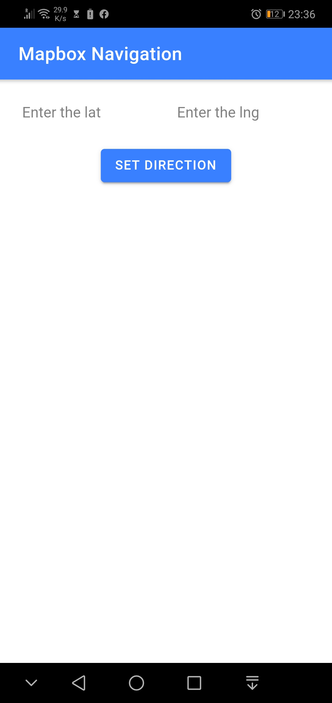
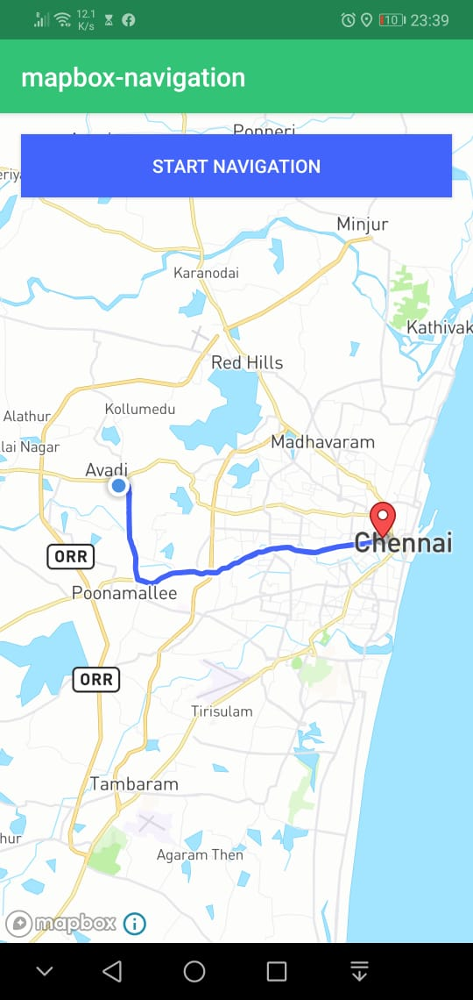
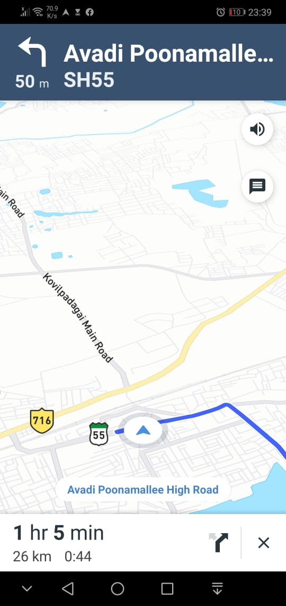

# IONIC MAPBOX NAVIGATION
  
  This project demonstrate the mapbox navigation 
with ionic using capacitor custom plugin class interface.

  When user enter the lat&lng and after set direction button
clicked. It will call the mapbox navigation ui by using 
the custom plugin method.

 Here i have used the sample code from mapbox and customized some 
code for setting direction from ionic in java.  

## ScreenShots

 
